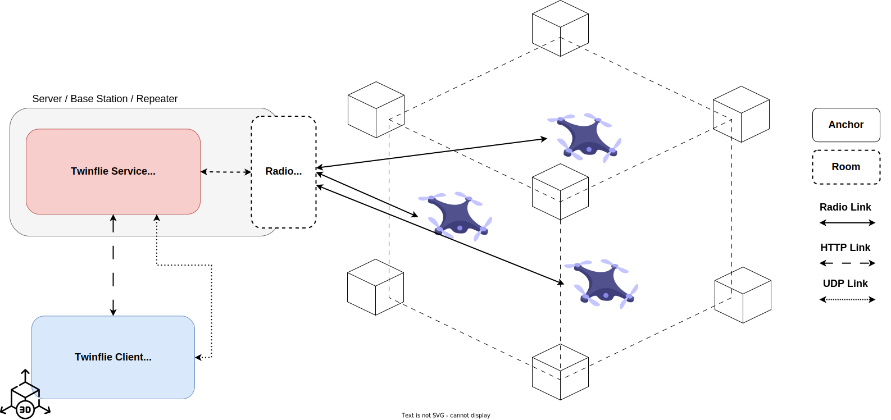
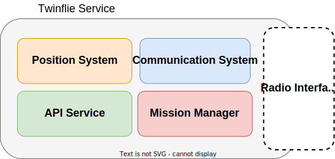
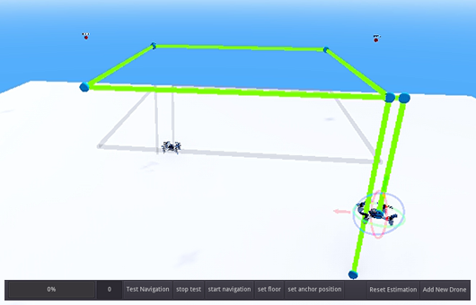
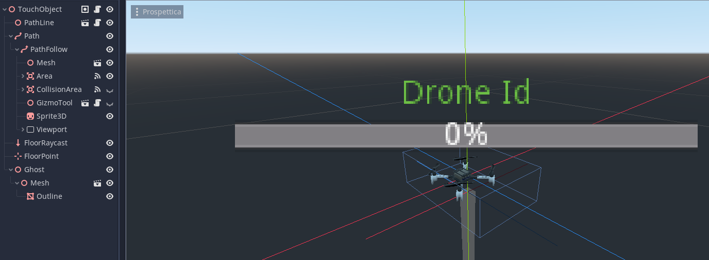

# Twinflie

A Digital Twin UAV Orchestrator and
Simulator

## Table of Contents

* [Introduction](#introduction)
* [Architecture](#architecture)
* [Backend Components](#backend-components)
* [Client](#client)
* [Twinflie Nodes](#twinflie-nodes)
* [Video Demostration](#video-demostration)
* [Publications and Citations](#publications-and-citations)

## Introduction

Twinflie is a simulation and monitoring orchestration system for swarms of UAVs in environments where UAV localization is feasible.

Thanks to this software, it is possible to simulate the behavior of a swarm of UAVs in a controlled environment and, at the same time, monitor the execution of missions.

## Architecture

  

Twinflie Architecture is composed by 2 main component a backend service and a client. The latter is built in Python and the former is built in Godot.

The communication between the backend and the client is done via a series of http API and a communication channel via udp, The UDP communication channel is used to share in real-time, with the least possible delay, the state of the drones, we will analyze the APIs in the next few slide.

The Backend also use a radio link to communicate with drones to command their movement or to read their position.

## Backend Components

  

The Backend Service manages the UAVs connected and provide a series of API.

When the connection to an UAV is established it is created an object that take the role of digital twin of the UAV.

In order to use your favorite UAV system, you just have to implement the interface that allows the communication with the UAV and the control system to command their movements and actions.

* **Position System**: Interfaces to the indoor/outdoor localisation system.
* **Communication System**: Interfaces to the communication radio protocol.
* **Mission Manager**: MAnages the mission of all UAVs.
* **API Service**: Serves a set of HTTP and UDP API to interact and interface the Client with the service.

## Client

  

The Twinflie Client is a Graphical Desktop and Mobile Application that uses Twinflie service API to implements these functionalities:

* Connect and Manage UAV
* Monitoring their status in real-time
* Visualize their positions in real and virtual world
* Test the entire mission in the simulated world
* Once the simulation success, launch the mission
* Monitor the missions for each UAV connected

  

The client was developed using the Godot Game Engine. Godot is an open-source and free game engine.
Godot uses a tree structure to handle what are called scenes, where each node in the tree can contain other nodes.

It has been chosen Godot due to its high portability across many devices, its entity management capabilities, its open-source nature and its high performance for an open-source game engine.

In Godot it was realized a digital environment where the drones behaviour can be simulated in a dynamic environment with special Twinflie nodes

### Twinflie Nodes

  

* **TouchObject**: is a scene designed to manage user
interactions and be able to select that node to then interact, extending the node to more nodes it was possible to implement such interactions, depending on the type of node.
* **AnchorObject**: represents an anchor in the real world
and allows, through interaction, to set the real position of the anchor. This node is represented by a spherical Mesh node and a Label indicating the anchor ID, also consists of an Area3D node and a collision form to manage user interaction with the node in the 3D world.
* **UAVObject**: extends the TouchObject node and is defined by a series of 3D-related nodes useful for drone management.
* **Path node**: is a special node that allows you to define a path of movement of the virtual node within the 3D environment. This Path will be followed by the node inside, called PathFollow, which represents, together with its Mesh3D and its CollisionArea, the virtual twin drone. In addition to these two nodes, the PathFollow also contains a particular CollisionArea user configurable via UI that allows, during the test and simulation of the mission, to define a safe area for which the drone must never collide with any other object.
* **Gizmo Tool**: is a node that allows the user to manipulate the location of the Path nodes in the 3D environment.
* **Ghost Node**: represents a twin shadow of the virtual drone, representing the real one in its position and status, allowing real-time monitoring to the user and the client of what the real drone is doing.

## Video Demostration

<iframe width="560" height="315" src="https://www.youtube.com/embed/zEM39KKYv1k?si=blwtUdr8_UCAed3u" title="YouTube video player" frameborder="0" allow="accelerometer; autoplay; clipboard-write; encrypted-media; gyroscope; picture-in-picture; web-share" allowfullscreen></iframe>

## Publications and Citations

Coming soon
